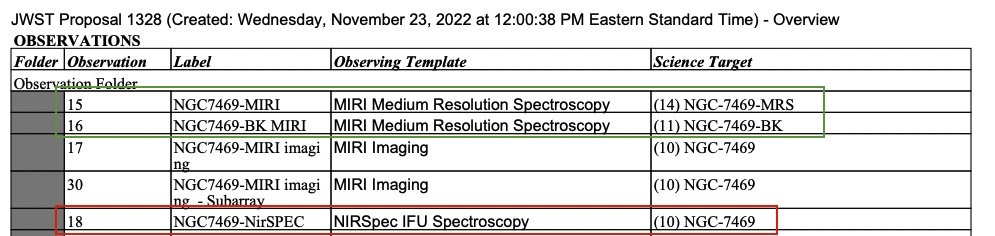

Daedalus needs a bit of info about the target you're trying to build. This configuration is passed via a [toml](https://toml.io/en/) file.

Example toml config file:

```
product_name = 'pipeline_1.20.2_vanilla'
output_dir = 'testing/test_out/'
crds_cache = 'testing/crds_cache/'

[target]
name = 'NGC_7469'
program = 1328

[target.instrument]
name = 'nirspec_ifu'
obs = 18

[[actions]]
name = 'download'

[[actions]]
name = 'pipeline'
```

Some options reference a program PDF for observation IDs. This PDF can be found at:
`https://www.stsci.edu/jwst-program-info/download/jwst/pdf/<program_id>`


For NGC 7469, the PDF is found [here](https://www.stsci.edu/jwst-program-info/download/jwst/pdf/1328/). The NIRSpec observation ID is boxed in red (18). The MIRI science and background observation IDs are boxed in green (15 and 16, respectively).





# MAST Tokens

When downloading exclusive access data, Daedalus needs a MAST token from an account with access to the data. Make sure your account is added to the program on MAST, and then create a token:

1. Go to the MAST token [page](https://auth.mast.stsci.edu/tokens) and login.
2. Click 'Create Token'.
3. Give your token a name and click 'Create Token'.
4. Copy the string of hex characters, this is your token.

To use this token in Daedalus, include it under the 'download' action:

```
[[actions]]
name = 'download'
mast_token = '85f578a5aa70439eb3f7385c4cd6a02a'
```

